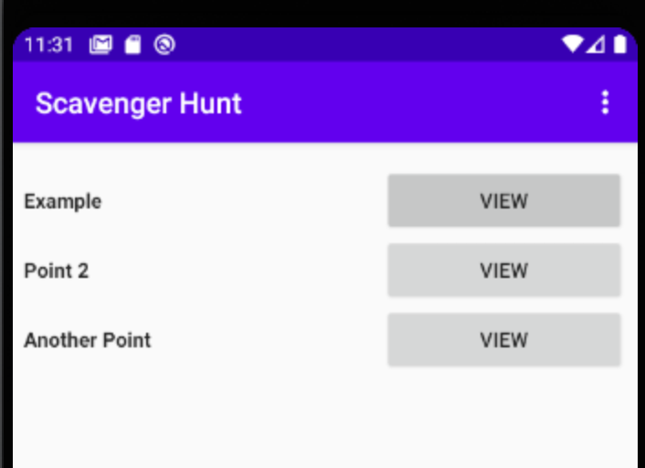
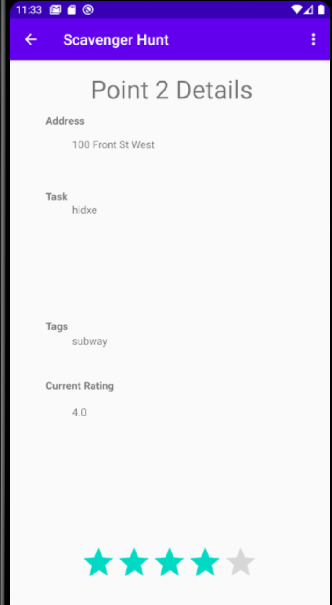
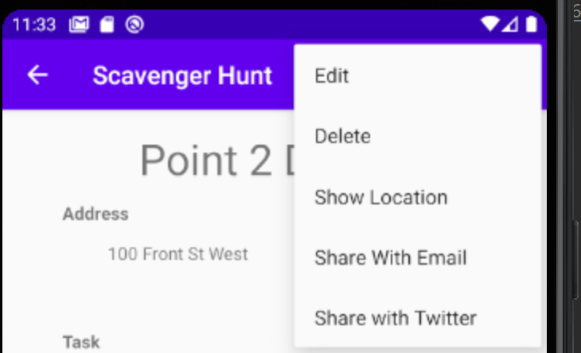
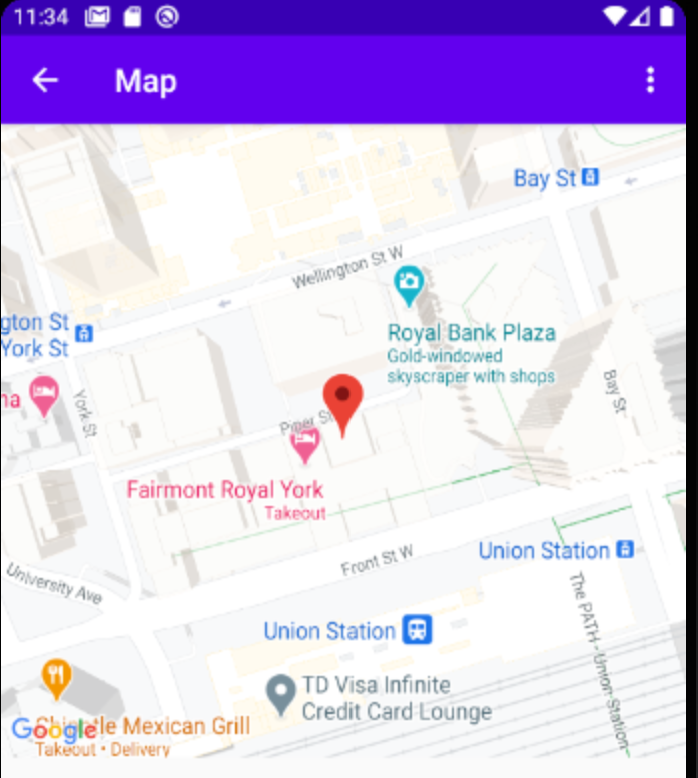
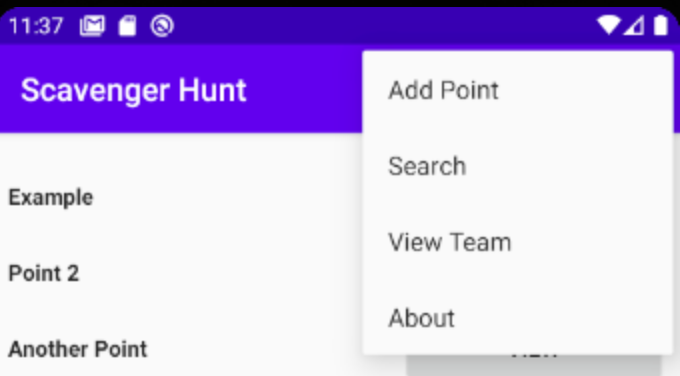
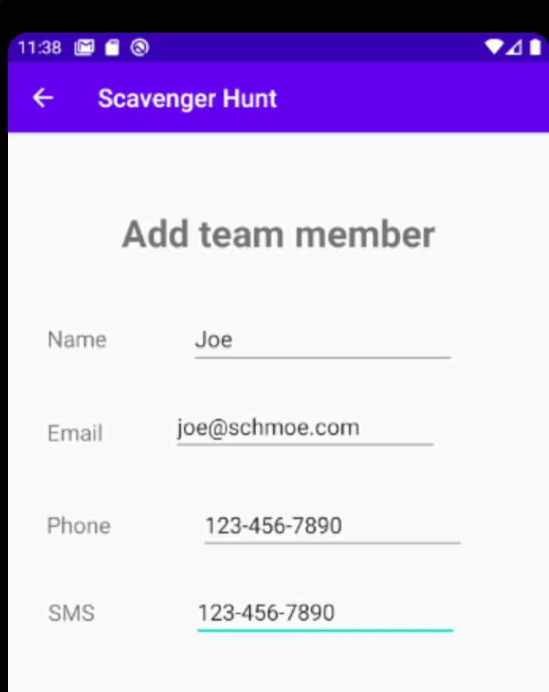

This is an example of a scavenger hunt app to be used to help teams find points or items they are searching for.

A few examples:

View points:  

Details of an added point:  

Location:  

Point location:  

Options:  

Add team member:  

